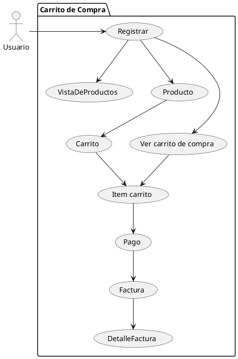
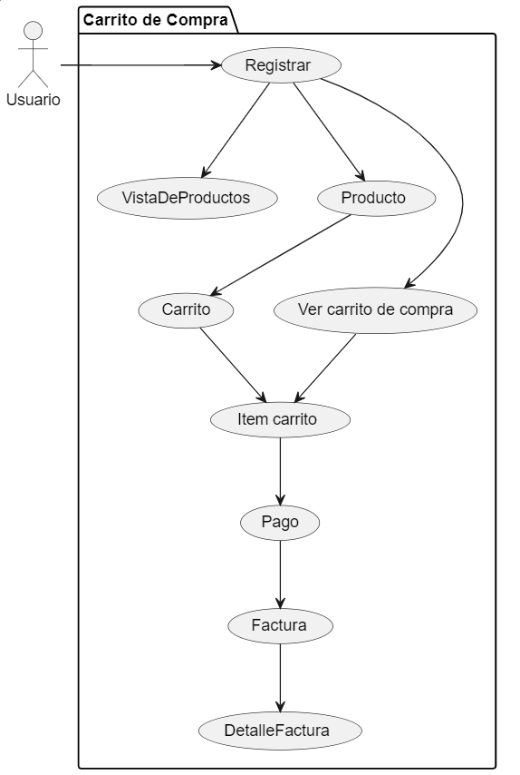

**Juan Esteban Oliveros.**
**Daniel Stiven Poveda.**

## CODIGO WSD

# Diagrama de Caso de Uso (Imagen)

# DESCRIPCIÓN.

Un diagrama de casos de uso es una herramienta visual en la ingeniería de software que representa las interacciones entre los usuarios (actores) y un sistema. Forma parte del Lenguaje Unificado de Modelado (UML, por sus siglas en inglés) y es usado para describir los requisitos funcionales de un sistema.

# Elementos clave de un diagrama de casos de uso

- Actores : Son las entidades externas que interactúan con el sistema, y ​​pueden ser personas (usuarios) o incluso otros sistemas. En el diagrama, los actores suelen representarse como figuras de "stickman" o simplemente nombres.

- Casos de Uso : Representan las funciones o acciones que el sistema ofrece a los actores. Estos están definidos desde la perspectiva del usuario, y no en términos de implementación. Se muestran como óvalos, y los nombres de los casos de uso describen las acciones (ej., "Registrar usuario" o "Realizar pago").

- Relaciones :
Asociación ( -->): Conecta actores con casos de uso, indicando que el actor participa en ese caso de uso.
Extender ( <<extend>>): Señala que un caso de uso puede incluir funcionalidad adicional bajo ciertas condiciones.
Incluir ( <<include>>): Indica que un caso de uso depende de otro y lo incluye como parte de su funcionalidad.

# EXPLICACIÓN 

- USUARIO
  - El usuario se registra para poder acceder a la vista de productos y a la creación de un carrito.

- INICIAR SESION
  - Inicia sesión para acceser al carrito de compra y a los productos.

- CARRITO
  - Crea un IntemCarrito que almacena un conjunuto de productos.

- PRODUCTO
  - Esta incormporado para que el usuario tenga una vista de los producos que ingrasa al carrito y quedan gaurdados en ItemCarrito.

- PAGO
  - Se genera al final del proceso de este carrito de compra

- FACTURA
  - Se genera despues de la acción de pago del carrito.

- DETALLE FACTURA
  - Se genera en consecuencia del pago dentro de la factura.