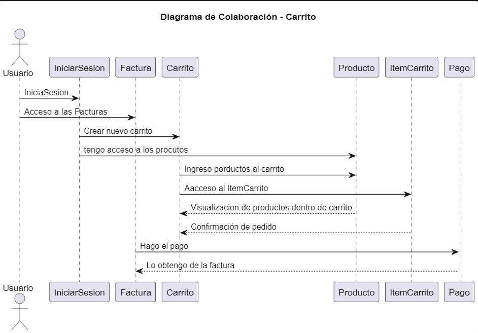

**Juan Esteban Oliveros.**
**Daniel Stiven Poveda.**
## CODIGO WSD.

```pl

@startuml Diagrama-De-Colaboración

title Diagrama de Colaboración - Carrito

actor Usuario as user

user->IniciarSesion: IniciaSesion
user->Factura: Acceso a las Facturas

IniciarSesion->Carrito: Crear nuevo carrito
IniciarSesion->Producto: tengo acceso a los procutos

Carrito->Producto: Ingreso porductos al carrito
Carrito->ItemCarrito: Aacceso al ItemCarrito
Producto-->Carrito: Visualizacion de productos dentro de carrito
ItemCarrito-->Carrito: Confirmación de pedido

Factura->Pago: Hago el pago
Pago-->Factura: Lo obtengo de la factura

@enduml

```
## DIAGRAMA DE COLABORACIÓN. 




## DESCRIPCIÓN.

Un Diagrama de Actividad es un tipo de diagrama de comportamiento en UML (Lenguaje de Modelado Unificado) que se utiliza para representar el flujo de trabajo o de procesos en un sistema. Este tipo de diagrama permite visualizar la secuencia de actividades o pasos que ocurren en un proceso, mostrando cómo se relacionan entre sí y cómo avanzan en función de ciertas condiciones.

**CARACTERÍSTICAS PRINCIPALES**

El diagrama de colaboración resalta las relaciones y asociaciones entre los objetos, ilustrando cómo se comunican entre sí para realizar ciertas funciones o procesos.
Representación Gráfica:

Los objetos se representan como nodos (o rectángulos) y las interacciones se muestran como líneas conectadas entre estos nodos. Las líneas pueden incluir números que indican el orden de los mensajes.
Mensajes:

Las interacciones se representan mediante mensajes que los objetos envían entre sí. Los mensajes pueden incluir información sobre la operación que se está invocando, parámetros y el orden de las operaciones.

## EXPLICACIÓN

- USUARIO
  - El usuario inicia Sesion y accede a la vista de los productos y a la creacion de un carrito de compras.

- INICIAR SESION
  - Me da el registro neceario para accedar a la creacion de un carrito y así mismo a los productos.

- CARRITO
  - Crea un IntemCarrito que almacena un conjunuto de productos.

- PRODUCTO
  - Esta incormporado para que el usuario tenga una vista de los producos que ingrasa al carrito y quedan gaurdados en ItemCarrito.

- PAGO
  - Se genera al final del proceso de este carrito de compra
.
- ITEMCARRITO
  - Es un conjunto de porductos generado por el Usuario dentro de un carrito.

- FACTURA
  - Se genera despues del pago del carrito.


