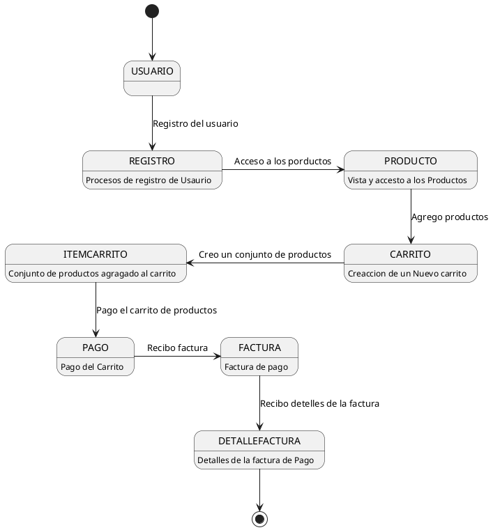
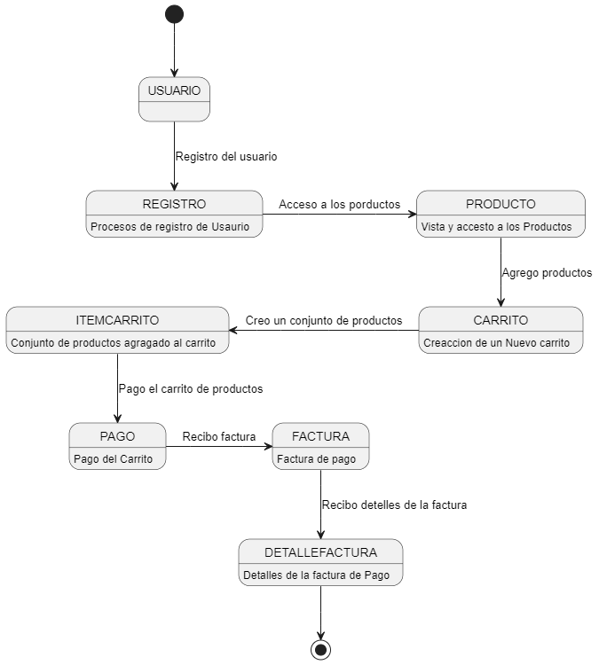

**Juan Esteban Oliveros.**
**Daniel Stiven Poveda.**

## CODIGO WSD

# Diagrama de Estado (Imagen)

# DESCRIPCIÓN.

Así es, el Diagrama de Estados, también conocido como Diagrama de Estado-Transición o Diagrama de Máquina de Estados, es una representación gráfica de los posibles estados que puede tener un objeto y las transiciones que ocurren entre estos estados como respuesta a eventos específicos. Este tipo de diagrama se usa en el modelado de sistemas para comprender cómo los objetos cambian de estado en función de las interacciones o condiciones externas, y es especialmente útil en el diseño de software orientado a objetos.

# EXPLICACIÓN 

- USUARIO
  - El usuario se registra para poder acceder a la vista de productos y a la creación de un carrito.

- INICIAR SESION
  - Inicia sesión para acceser al carrito de compra y a los productos.

- CARRITO
  - Crea un IntemCarrito que almacena un conjunuto de productos.

- PRODUCTO
  - Esta incormporado para que el usuario tenga una vista de los producos que ingrasa al carrito y quedan gaurdados en ItemCarrito.

- PAGO
  - Se genera al final del proceso de este carrito de compra

- FACTURA
  - Se genera despues de la acción de pago del carrito.

- DETALLE FACTURA
  - Se genera en consecuencia del pago dentro de la factura.