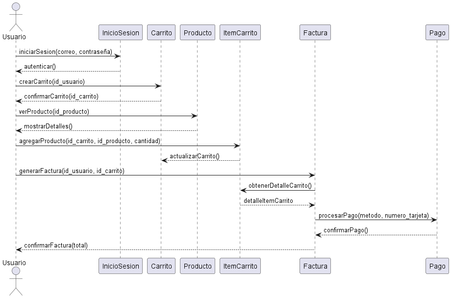

**Juan Esteban Oliveros.**
**Daniel Stiven Poveda.**
# Codigo WSD.
```js
@startuml
actor Usuario as user
participant "InicioSesion" as sesion
participant "Carrito" as carrito
participant "Producto" as producto
participant "ItemCarrito" as item
participant "Factura" as factura
participant "Pago" as pago

user -> sesion: iniciarSesion(correo, contraseña)
sesion --> user: autenticar()

user -> carrito: crearCarrito(id_usuario)
carrito --> user: confirmarCarrito(id_carrito)

user -> producto: verProducto(id_producto)
producto --> user: mostrarDetalles()

user -> item: agregarProducto(id_carrito, id_producto, cantidad)
item --> carrito: actualizarCarrito()

user -> factura: generarFactura(id_usuario, id_carrito)
factura -> item: obtenerDetalleCarrito()
factura <-- item: detalleItemCarrito
factura -> pago: procesarPago(metodo, numero_tarjeta)
pago --> factura: confirmarPago()
factura --> user: confirmarFactura(total)
@enduml


```

# Diagrama de Secuencia




# Descripcion:**
- El diagrama de secuencia describe el flujo de interacción entre los diferentes actores y objetos del sistema durante un proceso, en este caso, el flujo de un usuario que inicia sesión, crea un carrito de compras, añade productos y finalmente realiza una compra. Muestra el orden en que ocurren los mensajes y cómo se comunica cada componente entre sí para completar la transacción.

## Explicacion
**Elementos y Flujo:**

- *Usuario* (Actor): 
    - Representa a la persona que interactúa con el sistema. Inicia la sesión, crea un carrito, selecciona productos y realiza una compra.

- *InicioSesion:* 
    - Objeto que maneja la autenticación del usuario
    - Verifica las credenciales y autentica al usuario.
    - El usuario envía un mensaje iniciarSesion para autenticarse.
    - El sistema responde con una confirmación de autenticación.

- *Carrito:* 
    - Representa el carrito de compras creado por el usuario.
    - Después de autenticarse, el usuario crea un carrito, y el sistema confirma su creación.
- *Producto:* 
    - Objeto que representa un producto en el inventario.
    - El usuario consulta los detalles del producto y el sistema los muestra.
- *ItemCarrito:* 
    - Representa los productos específicos que el usuario agrega a su carrito.
    - El usuario envía un mensaje agregarProducto para añadir un producto al carrito, y el carrito se actualiza con el nuevo producto.
- *Factura:* 
    - Objeto que representa el comprobante de la transacción.
    - Cuando el usuario decide finalizar la compra, se genera una factura con todos los productos del carrito.
    - La factura solicita el detalle del carrito, y el sistema responde con el contenido del carrito.
- *Pago:* 
    - Objeto que procesa el pago del usuario.
    - El usuario proporciona detalles de pago, y el sistema confirma la transacción.
    - La factura se completa, y el sistema confirma la compra.

