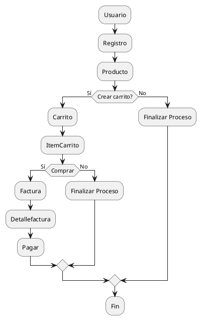

**Juan Esteban Oliveros.**
**Daniel Stiven Poveda.**
# Diagrama de Actividad.
## Codigo WSD

# Diagrama de Actividad (Imagen)

# DESCRIPCIÓN.

Diagrama de Colaboración: Se enfoca en las relaciones y conexiones entre objetos. No muestra una línea de tiempo, sino que ilustra cómo se comunican los objetos entre sí, destacando las conexiones y colaboraciones.

- Actividades Secuenciales : Muestra los pasos que deben realizarse uno tras otro en un proceso.

- Condiciones y Decisiones : Incluye bifurcaciones o puntos de decisión que guían el flujo a diferentes caminos según ciertas condiciones.

- Flujos Paralelos : Representa actividades que pueden suceder de manera simultánea, utilizando constructos como "fork" (inicio de actividades paralelas) y "join" (fin de actividades paralelas).

- Inicio y Fin : Incluye un nodo de inicio y al menos un nodo de fin para indicar dónde comienza y termina el proceso.

- Ciclos : Puede incluir bucles que repitan ciertos pasos hasta cumplir una condición específica.

# EXPLICACIÓN 

- USUARIO
  - El usuario se registra para poder acceder a la vista de productos y a la creación de un carrito.

- INICIAR SESION
  - Inicia sesión para acceser al carrito de compra y a los productos.

- CARRITO
  - Crea un IntemCarrito que almacena un conjunuto de productos.

- PRODUCTO
  - Esta incormporado para que el usuario tenga una vista de los producos que ingrasa al carrito y quedan gaurdados en ItemCarrito.

- PAGO
  - Se genera al final del proceso de este carrito de compra

- FACTURA
  - Se genera despues del pago del carrito.