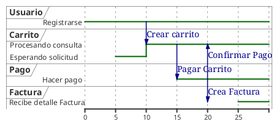

**Juan Esteban Oliveros.**
**Daniel Stiven Poveda.**

## CODIGO WSD

# Diagrama de  (Imagen)

# DESCRIPCIÓN.

Un diagrama de tiempo (o diagrama de secuencia ) en formato WSD muestra la interacción entre diferentes objetos o componentes de un sistema en un orden temporal. En PlantUML, puedes crear diagramas de tiempo usando una estructura similar a la de los diagramas de secuencia.

Este diagrama de tiempo ilustra cómo fluyen las solicitudes y respuestas a lo largo del sistema en una secuencia cronológica.

# EXPLICACIÓN 

- USUARIO
  - El usuario se registra para poder acceder a la creacion de un carrito en el Tiempo (0).

- INICIAR SESION
  - Inicia sesión para acceser al carrito de compra y a los productos en el Tiempo (5) .

- CARRITO
  - Crea un IntemCarrito que almacena un conjunuto de productos en el Tiempo (10) .

- PAGO
  - Se genera al final del proceso de este carrito de compra, en el diagrama esta representado en el tiempo (20)

- FACTURA
  - Se genera despues de la acción de pago del carrito en el Tiempo (25) .

- DETALLE FACTURA
  - Se genera en consecuencia del pago dentro de la factura en el Tiempo (25) .