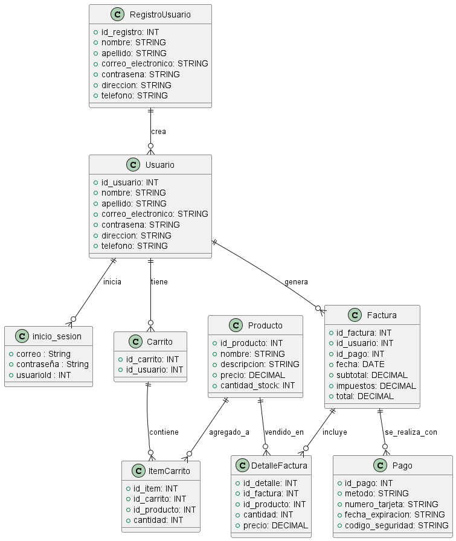

**Juan Esteban Oliveros.**
**Daniel Stiven Poveda.**
# Codigo WSD.
```js
@startuml Diagrama_Sistema

class RegistroUsuario {
    + id_registro: INT 
    + nombre: STRING 
    + apellido: STRING 
    + correo_electronico: STRING 
    + contrasena: STRING
    + direccion: STRING
    + telefono: STRING
}

class inicio_sesion {
    + correo : String 
    + contraseña : String 
    + usuarioId : INT
}

class Usuario {
    + id_usuario: INT 
    + nombre: STRING 
    + apellido: STRING 
    + correo_electronico: STRING 
    + contrasena: STRING 
    + direccion: STRING 
    + telefono: STRING 
}

class Producto {
    + id_producto: INT 
    + nombre: STRING 
    + descripcion: STRING 
    + precio: DECIMAL
    + cantidad_stock: INT 
}

class Carrito {
    + id_carrito: INT 
    + id_usuario: INT 
}

class ItemCarrito {
    + id_item: INT  
    + id_carrito: INT
    + id_producto: INT
    + cantidad: INT 
}

class Pago {
    + id_pago: INT
    + metodo: STRING
    + numero_tarjeta: STRING
    + fecha_expiracion: STRING
    + codigo_seguridad: STRING
}

class Factura {
    + id_factura: INT 
    + id_usuario: INT
    + id_pago: INT
    + fecha: DATE
    + subtotal: DECIMAL
    + impuestos: DECIMAL
    + total: DECIMAL
}

class DetalleFactura {
    + id_detalle: INT 
    + id_factura: INT 
    + id_producto: INT
    + cantidad: INT 
    + precio: DECIMAL 
}

' Relaciones
Usuario ||--o{ Carrito : tiene
Carrito ||--o{ ItemCarrito : contiene
Producto ||--o{ ItemCarrito : agregado_a
Usuario ||--o{ Factura : genera
Factura ||--o{ DetalleFactura : incluye
Producto ||--o{ DetalleFactura : vendido_en
Usuario ||--o{ inicio_sesion : inicia
RegistroUsuario ||--o{ Usuario : crea
Factura ||--o{ Pago : se_realiza_con
@enduml


```

# Diagrama de clase




# Descripcion:**
Sistema de Gestion de una base de datos relacionada a un carrito de compras.
el diagrama muestra como el funcionamiento y las relaciones entre las distintas entidades del carrito de compras.

**Explicacion**
Es un diagrama de clases, con la relaciones de las entidades y sus atributos.
Trata de dar a entender la relacion y funcionamiento de la base de datos.
