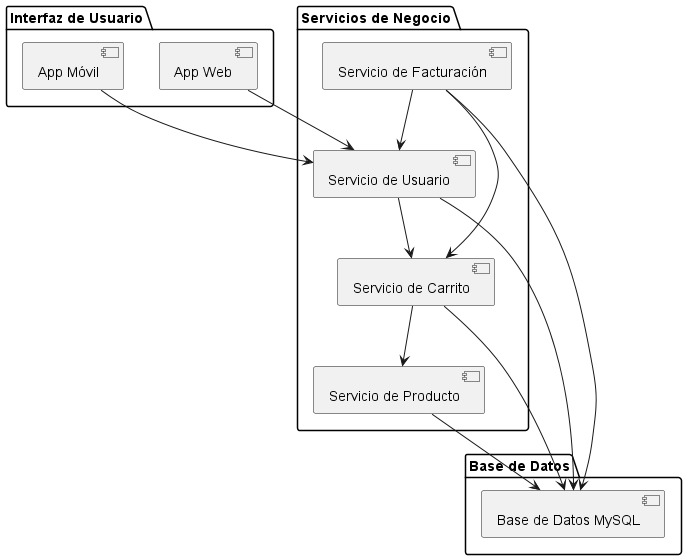

**Juan Esteban Oliveros.**
**Daniel Stiven Poveda.**
# Codigo WSD.
```js
@startuml Diagrama_Componentes

package "Interfaz de Usuario" {
    [App Web]
    [App Móvil]
}

package "Servicios de Negocio" {
    [Servicio de Usuario]
    [Servicio de Carrito]
    [Servicio de Facturación]
    [Servicio de Producto]
}

package "Base de Datos" {
    [Base de Datos MySQL]
}

[App Web] --> [Servicio de Usuario]
[App Móvil] --> [Servicio de Usuario]

[Servicio de Usuario] --> [Servicio de Carrito]
[Servicio de Carrito] --> [Servicio de Producto]
[Servicio de Facturación] --> [Servicio de Usuario]
[Servicio de Facturación] --> [Servicio de Carrito]
[Servicio de Facturación] --> [Base de Datos MySQL]

[Servicio de Usuario] --> [Base de Datos MySQL]
[Servicio de Carrito] --> [Base de Datos MySQL]
[Servicio de Producto] --> [Base de Datos MySQL]

@enduml


```

# Diagrama de Componentes




# Descripcion:**
El Diagrama de Componentes se usa para mostrar la arquitectura de software de alto nivel, dividiendo el sistema en componentes o módulos funcionales, y visualizando cómo se comunican entre ellos. Es útil para comprender cómo se organiza la aplicación en términos de sus principales partes funcionales.


## Explicacion
**Elementos:**
- Este diagrama está dividido en tres paquetes principales:

- *Interfaz de Usuario:* Incluye la "App Web" y la "App Móvil", que representan los puntos de acceso desde donde los usuarios interactúan con el sistema.
- *Servicios de Negocio:*
    - Contiene los servicios lógicos que gestionan las funcionalidades del sistema:
        - Servicio de Usuario: Maneja la autenticación y la gestión del perfil de usuario.
        - Servicio de Carrito: Administra el carrito de compras y los elementos agregados.
        - Servicio de Facturación: Genera las facturas y gestiona los pagos.
        - Servicio de Producto: Se encarga de la gestión de productos, como consultar y actualizar inventario.
- *Base de Datos:* Representa la base de datos en MySQL donde se almacenan los datos de usuarios, productos, carritos, facturas y pagos.

**Relaciones:**

- Cada componente de la Interfaz de Usuario (App Web y App Móvil) interactúa con el Servicio de Usuario a través de HTTP. 
- A su vez, los servicios de negocio interactúan con la Base de Datos para obtener o guardar información, utilizando JDBC u otros métodos de conexión.