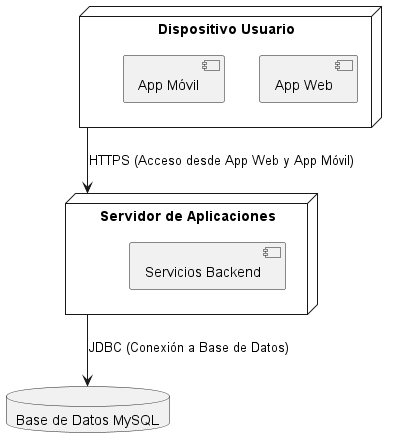

**Juan Esteban Oliveros.**
**Daniel Stiven Poveda.**
# Codigo WSD.
```js
@startuml Diagrama_Despliegue

node "Dispositivo Usuario" as usuario {
    [App Web]
    [App Móvil]
}

node "Servidor de Aplicaciones" as servidor {
    [Servicios Backend]
}

database "Base de Datos MySQL" as baseDeDatos

usuario --> servidor : HTTPS (Acceso desde App Web y App Móvil)
servidor --> baseDeDatos : JDBC (Conexión a Base de Datos)

@enduml

```

# Diagrama de Despliegue




# Descripción:
El Diagrama de Despliegue muestra la infraestructura física o el entorno de hardware en el cual se despliega el sistema. Ayuda a visualizar los nodos (servidores, bases de datos, dispositivos de usuario) y cómo están conectados entre sí.

## Explicación
**Elementos:**
- Este diagrama incluye tres nodos principales:
  - **Usuario:** Representa el dispositivo del usuario (como una computadora o smartphone) que accede a la aplicación, ya sea mediante la App Web o la App Móvil.
  - **Servidor de Aplicaciones:** Es el servidor donde se ejecutan los servicios de negocio del sistema, como el Servicio de Usuario, Servicio de Carrito, Servicio de Facturación y Servicio de Producto.
  - **Base de Datos:** Representa la base de datos MySQL donde se almacenan todos los datos del sistema.

**Relaciones:**
- La *App Web* y la *App Móvil* se comunican con el *Servidor de Aplicaciones* a través de HTTPS.
- El *Servidor de Aplicaciones* se conecta con la *Base de Datos* mediante JDBC o un método de conexión similar.

