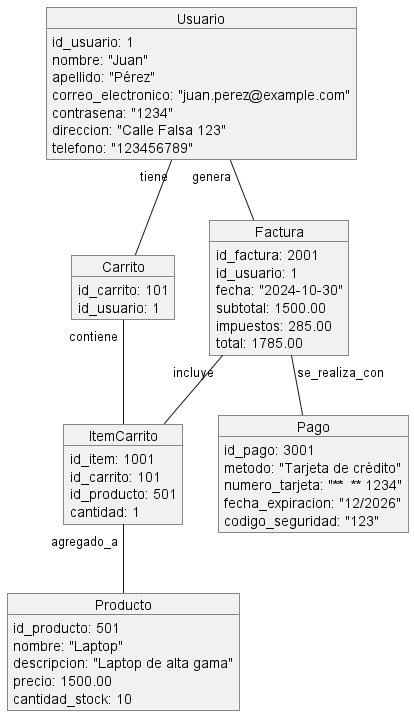

**Juan Esteban Oliveros.**
**Daniel Stiven Poveda.**
# Codigo WSD.
```js
@startuml
object Usuario {
    id_usuario: 1
    nombre: "Juan"
    apellido: "Oliveros"
    correo_electronico: "juan.Oliveros@example.com"
    contrasena: "1234"
    direccion: "Calle Falsa 123"
    telefono: "123456789"
}

object Carrito {
    id_carrito: 101
    id_usuario: 1
}

object Producto {
    id_producto: 501
    nombre: "Laptop"
    descripcion: "Laptop de alta gama"
    precio: 1500.00
    cantidad_stock: 10
}

object ItemCarrito {
    id_item: 1001
    id_carrito: 101
    id_producto: 501
    cantidad: 1
}

object Factura {
    id_factura: 2001
    id_usuario: 1
    fecha: "2024-10-30"
    subtotal: 1500.00
    impuestos: 285.00
    total: 1785.00
}

object Pago {
    id_pago: 3001
    metodo: "Tarjeta de crédito"
    numero_tarjeta: "**** **** **** 1234"
    fecha_expiracion: "12/2026"
    codigo_seguridad: "123"
}

Usuario "tiene" -- Carrito
Carrito "contiene" -- ItemCarrito
ItemCarrito "agregado_a" -- Producto
Usuario "genera" -- Factura
Factura "se_realiza_con" -- Pago
Factura "incluye" -- ItemCarrito

@enduml


```

# Diagrama de Objetos




# Descripcion:**
- El diagrama de objetos muestra instancias específicas de las clases en el sistema, permitiéndonos ver cómo podrían verse los datos de un ejemplo real. Aquí, cada "objeto" representa una instancia de una clase (como un "Usuario" específico o un "Producto" particular), mostrando valores de ejemplo para sus atributos. Este diagrama te ayuda a visualizar una situación concreta dentro del sistema, en lugar de mostrar la estructura general de clases como en el diagrama de clases.

## Explicacion
**Elementos:**

- *Usuario:* Instancia de la clase Usuario con atributos específicos de un usuario llamado "Juan Pérez". Representa a un cliente registrado en el sistema.

- *Carrito:* Instancia de Carrito asociada con el usuario "Juan". Este objeto refleja el carrito de compras que el usuario ha creado para gestionar sus productos.

- *Producto:* Representa un producto específico en el inventario, como una "Laptop". Incluye detalles como nombre, descripción, precio y cantidad en stock.

- *ItemCarrito:* Instancia de ItemCarrito que muestra un producto agregado al carrito del usuario. Define la cantidad de un producto específico que el usuario ha agregado a su carrito.

- *Factura:* Objeto Factura generado cuando el usuario finaliza su compra. Incluye detalles financieros como subtotal, impuestos y total.

- *Pago:* Objeto que representa los detalles del método de pago utilizado para la compra, incluyendo tipo de pago y datos de la tarjeta.

**Relaciones:**

- Usuario tiene un Carrito asociado.

- El Carrito contiene uno o más ItemCarrito que representan los productos en el carrito.

- Producto está relacionado con ItemCarrito para mostrar el producto específico agregado al carrito.

- Factura es generada por el Usuario al finalizar la compra.

- Factura incluye los ItemCarrito y se completa mediante un Pago.
