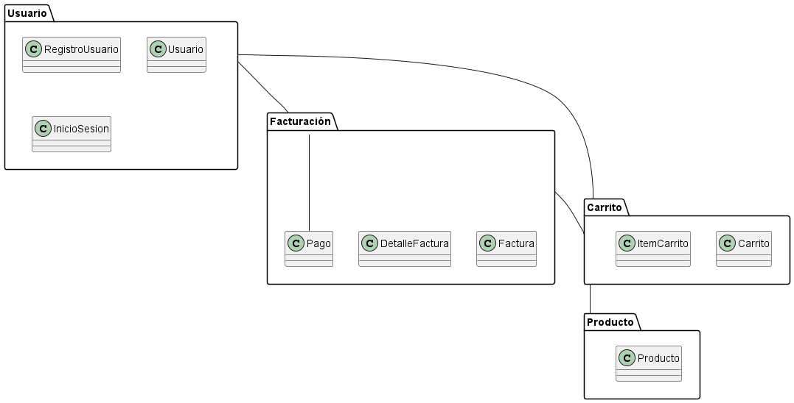

**Juan Esteban Oliveros.**
**Daniel Stiven Poveda.**
# Codigo WSD.
```js
@startuml Diagrama_Paquetes

package "Usuario" {
    class RegistroUsuario
    class Usuario
    class InicioSesion
}

package "Carrito" {
    class Carrito
    class ItemCarrito
}

package "Facturación" {
    class Factura
    class DetalleFactura
    class Pago
}

package "Producto" {
    class Producto
}

Usuario -- Carrito
Carrito -- Producto
Facturación -- Carrito
Facturación -- Pago
Usuario -- Facturación

@enduml

```

# Diagrama de Paquetes




# Descripción:
El Diagrama de Paquetes organiza las clases y componentes del sistema en módulos o paquetes lógicos, facilitando la visualización de la estructura modular y la relación entre ellos. Es útil para ver cómo están agrupados los elementos del sistema en distintos contextos o subsistemas.

## Explicación
**Elementos:**
- Este diagrama incluye cuatro paquetes principales que agrupan las clases del sistema:
  - **Usuario:** Contiene las clases `RegistroUsuario`, `Usuario`, e `InicioSesion`, relacionadas con la gestión y autenticación de usuarios.
  - **Carrito:** Incluye `Carrito` e `ItemCarrito`, las cuales representan el carrito de compras y los productos agregados a él.
  - **Facturación:** Contiene `Factura`, `DetalleFactura` y `Pago`, que representan el proceso de facturación y el pago de las compras realizadas.
  - **Producto:** Incluye la clase `Producto`, que representa los artículos disponibles en el sistema.

**Relaciones:**
- Cada paquete interactúa con otros según las funcionalidades que ofrece. Por ejemplo, el *Usuario* puede tener un *Carrito*, el *Carrito* contiene *Productos*, y la *Facturación* incluye el *Pago* y se basa en los productos del carrito.

