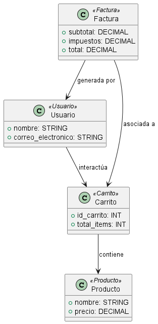

**Juan Esteban Oliveros.**
**Daniel Stiven Poveda.**
# Codigo WSD.
```js
@startuml Diagrama_Perfil

class Usuario <<Usuario>> {
    + nombre: STRING
    + correo_electronico: STRING
}

class Carrito <<Carrito>> {
    + id_carrito: INT
    + total_items: INT
}

class Factura <<Factura>> {
    + subtotal: DECIMAL
    + impuestos: DECIMAL
    + total: DECIMAL
}

class Producto <<Producto>> {
    + nombre: STRING
    + precio: DECIMAL
}

Usuario --> Carrito : "interactúa"
Carrito --> Producto : "contiene"
Factura --> Carrito : "asociada a"
Factura --> Usuario : "generada por"

@enduml


```

# Diagrama de Perfil




# Descripción:
El Diagrama de Perfil se usa para personalizar el modelo UML mediante estereotipos, etiquetas y propiedades adicionales que extienden UML según las necesidades del sistema. Esto permite adaptar el diagrama para que sea más específico a un dominio o contexto determinado.

## Explicación
**Elementos:**
- En este diagrama, se definen estereotipos personalizados para representar los tipos específicos de entidades en el sistema de compras en línea:
  - **Usuario:** Con atributos como `nombre` y `correo_electronico`, que representan información básica del usuario y son esenciales para la gestión de cuentas y comunicaciones.
  - **Carrito:** Representa el carrito de compras del usuario, con atributos como `id_carrito` y `total_items`, permitiendo rastrear los productos seleccionados antes de la compra.
  - **Factura:** Incluye atributos financieros (`subtotal`, `impuestos`, `total`) relacionados con una compra, facilitando el procesamiento de pagos y la generación de recibos.
  - **Producto:** Representa un producto específico en el inventario, con atributos `nombre` y `precio`, cruciales para la presentación y venta de artículos.

**Relaciones:**
- Cada estereotipo pertenece al perfil "Sistema de Carrito de Compras", lo cual organiza estos estereotipos personalizados bajo un perfil único. Esto facilita la creación de un modelo UML específico para el dominio del sistema de compras, mejorando la claridad en el diseño del sistema.
- Las relaciones entre las entidades describen cómo interactúan en el flujo del proceso de compra, como cuando un `Usuario` crea un `Carrito`, agrega `Productos`, y finalmente genera una `Factura` para completar la transacción.